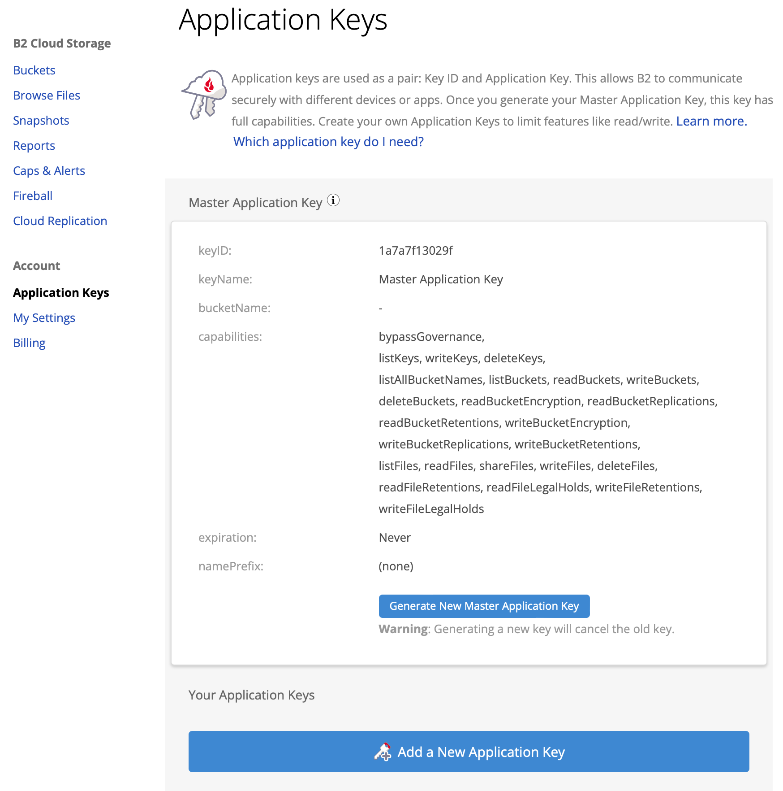
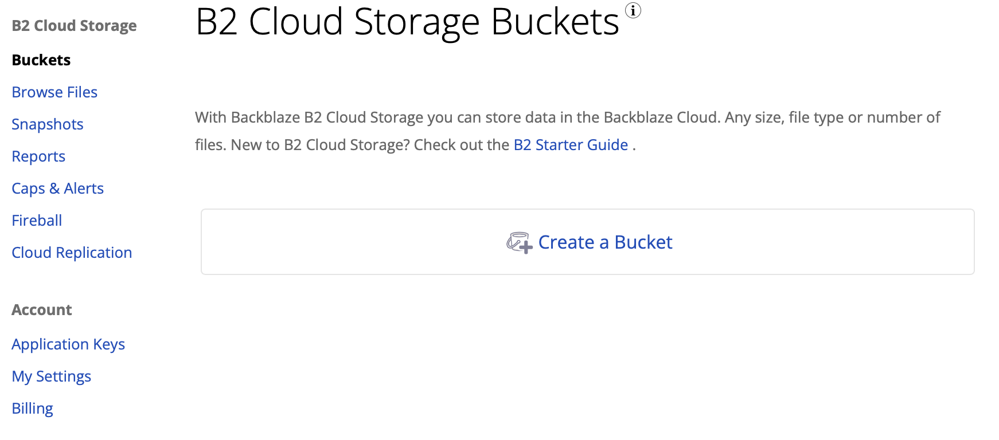
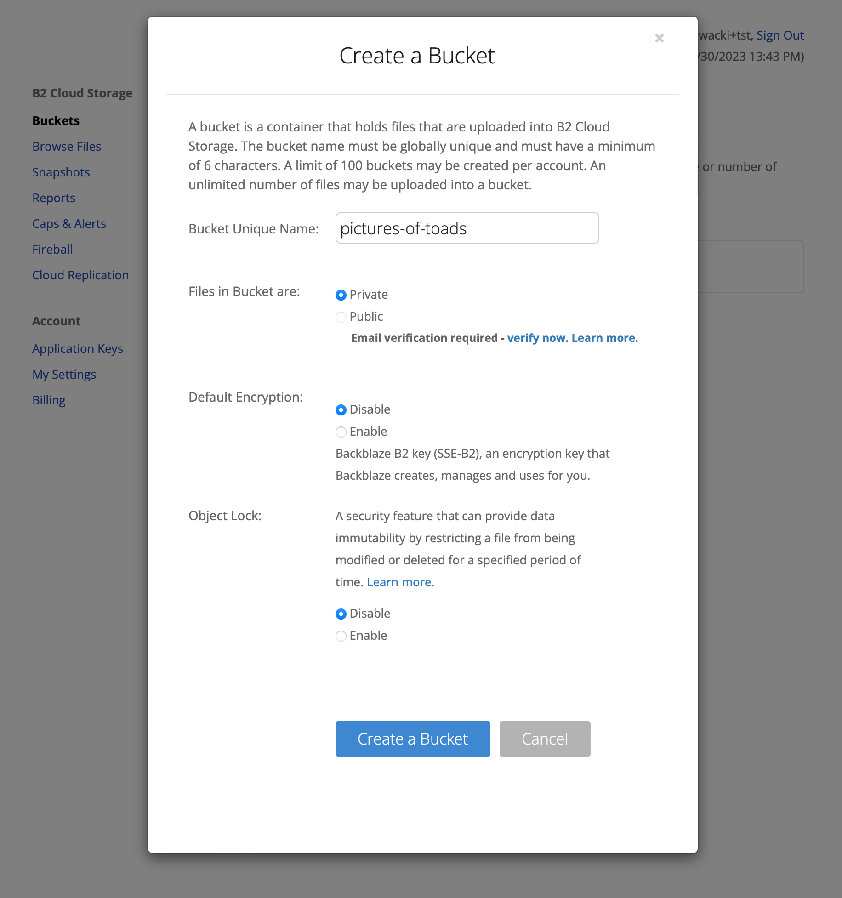
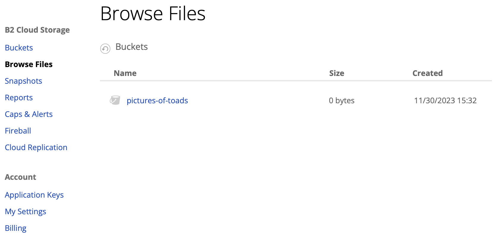
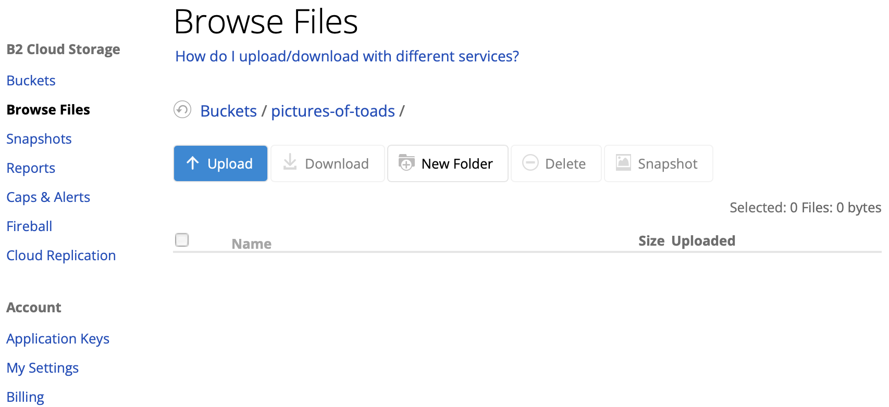
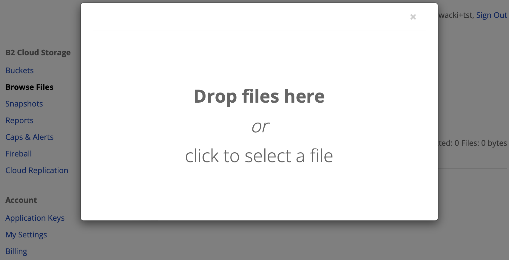

#########################################
Tutorials
#########################################

.. raw:: html

    

***********************
Installation
***********************

To continue with any of the tutorials below, you must install your tool of choice. You can find short
installation instructions below.

.. raw:: html

        <nav class="navbar navbar-expand-lg navbar-light bg-light"
             style="padding-left: 8px; background-color: #cccccc63; border: 1px solid #ccc;">

        

            <button type="button" class="top-level-selector btn btn-secondary" onclick="unfoldCodeSnippets(event, 'WebUI')" data-language="WebUI">WebUI</button>
            

                <button type="button" class="top-level-selector btn btn-secondary dropdown-toggle" data-toggle="dropdown"
                        aria-haspopup="true" aria-expanded="false">
                    Command line
                </button>
                

                    <button class="dropdown-item" onclick="unfoldCodeSnippets(event, 'B2 CLI')" data-language="B2 CLI">B2 CLI</a>
                    <button class="dropdown-item" onclick="unfoldCodeSnippets(event, 'AWS CLI')" data-language="AWS CLI">AWS CLI</a>
                

            

            

                <button type="button" class="top-level-selector btn btn-secondary dropdown-toggle" data-toggle="dropdown"
                        aria-haspopup="true" aria-expanded="false">
                    SDK
                </button>
                

                    <button class="dropdown-item" onclick="unfoldCodeSnippets(event, 'b2-sdk-python')" data-language="b2-sdk-python">b2-sdk-python</a>
                    <button class="dropdown-item" onclick="unfoldCodeSnippets(event, 'boto3')" data-language="boto3">boto3</a>
                

            

        

    </nav>

        

No installation required.

.. raw:: html

    

    

.. code-block:: shell

    pip install b2

.. raw:: html

    

    

Follow instructions here: `https://docs.aws.amazon.com/cli/latest/userguide/getting-started-install.html
<https://docs.aws.amazon.com/cli/latest/userguide/getting-started-install.html>`_

.. raw:: html

    

    

.. code-block:: shell

    pip install b2sdk

.. raw:: html

    

    

.. code-block:: shell

    pip install boto3

.. raw:: html

    

***********************
Authorization
***********************

After signing in to `B2 Cloud Storage website <https://www.backblaze.com/cloud-storage>`_ go to keys
"Application Keys" view.

Hit "Add a New Application Key" and fill out the details (just the name, for the sake of this tutorial).

.. image:: ./key_creation_2.png

Take note of the presented `keyId` and `applicationKey`.

.. raw:: html

        <nav class="navbar navbar-expand-lg navbar-light bg-light"
             style="padding-left: 8px; background-color: #cccccc63; border: 1px solid #ccc;">

        

            <button type="button" class="top-level-selector btn btn-secondary" onclick="unfoldCodeSnippets(event, 'WebUI')" data-language="WebUI">WebUI</button>
            

                <button type="button" class="top-level-selector btn btn-secondary dropdown-toggle" data-toggle="dropdown"
                        aria-haspopup="true" aria-expanded="false">
                    Command line
                </button>
                

                    <button class="dropdown-item" onclick="unfoldCodeSnippets(event, 'B2 CLI')" data-language="B2 CLI">B2 CLI</a>
                    <button class="dropdown-item" onclick="unfoldCodeSnippets(event, 'AWS CLI')" data-language="AWS CLI">AWS CLI</a>
                

            

            

                <button type="button" class="top-level-selector btn btn-secondary dropdown-toggle" data-toggle="dropdown"
                        aria-haspopup="true" aria-expanded="false">
                    SDK
                </button>
                

                    <button class="dropdown-item" onclick="unfoldCodeSnippets(event, 'b2-sdk-python')" data-language="b2-sdk-python">b2-sdk-python</a>
                    <button class="dropdown-item" onclick="unfoldCodeSnippets(event, 'boto3')" data-language="boto3">boto3</a>
                

            

        

    </nav>

        

No authorization, past the login screen, required.

.. raw:: html

    

    

.. code-block:: shell

    B2_APPLICATION_KEY_ID=keyId B2_APPLICATION_KEY=applicationKey b2 authorize-account
    # After this operation, your CLI tool is authorized and
    # all following commands will operate in the
    # context of this account.

.. raw:: html

    

    

.. code-block:: shell

    aws configure --profile b2tutorial
    # fill in the prompting inputs as follows:
    # AWS Access Key ID [None]: keyId
    # AWS Secret Access Key [None]: applicationKey
    # Default region name [None]:
    # Default output format [None]: json
    aws configure --profile b2tutorial set default.s3.signature_version s3v4

In order to interact with B2 using :code:`aws` CLI you will need to provide the :code:`--profile` and
:code:`--endpoint-url` parameters with each invocation, e.g.

.. code-block:: shell

    aws –-profile b2tutorial --endpoint-url https://s3.us-west-004.backblazeb2.com s3api list-buckets

To get your :code:`--endpoint-url` follow `this guide <./s3_endpoint_url.html>`_

.. raw:: html

    

    

.. code-block:: python

    from b2sdk.v2 import B2Api
    b2_api = B2Api(info)
    b2_api.authorize_account("production", keyId, applicationKey)
    # from now on, any operation you make on `b2api` will be executed in the context of your account

.. raw:: html

    

    

.. code-block:: python

    import boto3
    from botocore.client import Config
    b2 = boto3.resource(
        service_name='s3',
        endpoint_url='https://s3.us-west-004.backblazeb2.com',
        aws_access_key_id=keyId,
        aws_secret_access_key=applicationKey,
        config=Config(signature_version='s3v4'),
    )

To get your :code:`--endpoint-url` follow `this guide <./s3_endpoint_url.html>`_

.. raw:: html

    

***********************
Key creation
***********************

.. raw:: html

        <nav class="navbar navbar-expand-lg navbar-light bg-light"
             style="padding-left: 8px; background-color: #cccccc63; border: 1px solid #ccc;">

        

            <button type="button" class="top-level-selector btn btn-secondary" onclick="unfoldCodeSnippets(event, 'WebUI')" data-language="WebUI">WebUI</button>
            

                <button type="button" class="top-level-selector btn btn-secondary dropdown-toggle" data-toggle="dropdown"
                        aria-haspopup="true" aria-expanded="false">
                    Command line
                </button>
                

                    <button class="dropdown-item" onclick="unfoldCodeSnippets(event, 'B2 CLI')" data-language="B2 CLI">B2 CLI</a>
                    <button class="dropdown-item" onclick="unfoldCodeSnippets(event, 'AWS CLI')" data-language="AWS CLI">AWS CLI</a>
                

            

            

                <button type="button" class="top-level-selector btn btn-secondary dropdown-toggle" data-toggle="dropdown"
                        aria-haspopup="true" aria-expanded="false">
                    SDK
                </button>
                

                    <button class="dropdown-item" onclick="unfoldCodeSnippets(event, 'b2-sdk-python')" data-language="b2-sdk-python">b2-sdk-python</a>
                    <button class="dropdown-item" onclick="unfoldCodeSnippets(event, 'boto3')" data-language="boto3">boto3</a>
                

            

        

    </nav>

        

As presented in `Authorization`_

.. raw:: html

    

    

.. code-block:: shell

    b2 create-key --allCapabilities toad-enthusiast
    # you will see keyId and applicationKey

.. raw:: html

    

    

Not supported.

.. raw:: html

    

    

.. code-block:: python

    from b2sdk.v2 import ALL_CAPABILITIES
    key = b2_api.create_key(ALL_CAPABILITIES, 'toad-enthusiast')
    print(key.id_, key.application_key)

.. raw:: html

    

    

Not supported.

.. raw:: html

    

**********************************************
Buckets
**********************************************

Before you start uploading and downloading objects (files) you must create a bucket.

.. raw:: html

        <nav class="navbar navbar-expand-lg navbar-light bg-light"
             style="padding-left: 8px; background-color: #cccccc63; border: 1px solid #ccc;">

        

            <button type="button" class="top-level-selector btn btn-secondary" onclick="unfoldCodeSnippets(event, 'WebUI')" data-language="WebUI">WebUI</button>
            

                <button type="button" class="top-level-selector btn btn-secondary dropdown-toggle" data-toggle="dropdown"
                        aria-haspopup="true" aria-expanded="false">
                    Command line
                </button>
                

                    <button class="dropdown-item" onclick="unfoldCodeSnippets(event, 'B2 CLI')" data-language="B2 CLI">B2 CLI</a>
                    <button class="dropdown-item" onclick="unfoldCodeSnippets(event, 'AWS CLI')" data-language="AWS CLI">AWS CLI</a>
                

            

            

                <button type="button" class="top-level-selector btn btn-secondary dropdown-toggle" data-toggle="dropdown"
                        aria-haspopup="true" aria-expanded="false">
                    SDK
                </button>
                

                    <button class="dropdown-item" onclick="unfoldCodeSnippets(event, 'b2-sdk-python')" data-language="b2-sdk-python">b2-sdk-python</a>
                    <button class="dropdown-item" onclick="unfoldCodeSnippets(event, 'boto3')" data-language="boto3">boto3</a>
                

            

        

    </nav>

        

Go to buckets view.

Hit "create bucket" and fill out the details.

.. raw:: html

    

    

.. code-block:: shell

    b2 create-bucket pictures-of-toads allPrivate

.. raw:: html

    

    

.. code-block:: shell

    aws --profile b2tutorial --endpoint-url https://s3.us-west-004.backblazeb2.com s3api create-bucket --bucket pictures-of-toads

.. raw:: html

    

    

.. code-block:: python

    bucket = b2api.create_bucket('pictures-of-toads', 'allPrivate')

.. raw:: html

    

    

.. code-block:: python

    b2.create_bucket(Bucket='pictures-of-toads', ACL='private')

.. raw:: html

    

NOTE: bucket name has to be globally unique, otherwise you will get an error. For the sake of this tutorial we only
focus on private buckets.

***********************
Simple upload
***********************

Now, on any machine that ran :code:`b2 authorize-account` with the same key you can upload a file to
:code:`pictures-of-toads`:

.. raw:: html

        <nav class="navbar navbar-expand-lg navbar-light bg-light"
             style="padding-left: 8px; background-color: #cccccc63; border: 1px solid #ccc;">

        

            <button type="button" class="top-level-selector btn btn-secondary" onclick="unfoldCodeSnippets(event, 'WebUI')" data-language="WebUI">WebUI</button>
            

                <button type="button" class="top-level-selector btn btn-secondary dropdown-toggle" data-toggle="dropdown"
                        aria-haspopup="true" aria-expanded="false">
                    Command line
                </button>
                

                    <button class="dropdown-item" onclick="unfoldCodeSnippets(event, 'B2 CLI')" data-language="B2 CLI">B2 CLI</a>
                    <button class="dropdown-item" onclick="unfoldCodeSnippets(event, 'AWS CLI')" data-language="AWS CLI">AWS CLI</a>
                

            

            

                <button type="button" class="top-level-selector btn btn-secondary dropdown-toggle" data-toggle="dropdown"
                        aria-haspopup="true" aria-expanded="false">
                    SDK
                </button>
                

                    <button class="dropdown-item" onclick="unfoldCodeSnippets(event, 'b2-sdk-python')" data-language="b2-sdk-python">b2-sdk-python</a>
                    <button class="dropdown-item" onclick="unfoldCodeSnippets(event, 'boto3')" data-language="boto3">boto3</a>
                

            

        

    </nav>

        

Go to file browsing view.

Choose destination bucket.

Upload your file.

.. raw:: html

    

    

.. code-block:: shell

    b2 upload-file pictures-of-toads /home/todd/pictures/fire-bellied-toad.png fire-bellied-toad.png

.. raw:: html

    

    

.. code-block:: shell

    aws --profile b2tutorial --endpoint-url https://s3.us-west-004.backblazeb2.com s3api put-object \
      --bucket pictures-of-toads --key fire-bellied-toad.png --body /home/todd/pictures/fire-bellied-toad.png

.. raw:: html

    

    

.. code-block:: python

    bucket = b2api.get_bucket_by_name('pictures-of-toads')
    bucket.upload_local_file('/home/todd/pictures/fire-bellied-toad.png', 'fire-bellied-toad.png')

.. raw:: html

    

    

.. code-block:: python

    with open('/home/todd/pictures/fire-bellied-toad.png', 'br') as file:
        b2.Object(  # TODO: this doesn't work, need to figure out why
            'fire-bellied-toad.png',
            'pictures-of-toads',
        ).put(Body=file)

.. raw:: html

    

this will create an object that users of your account can download.
