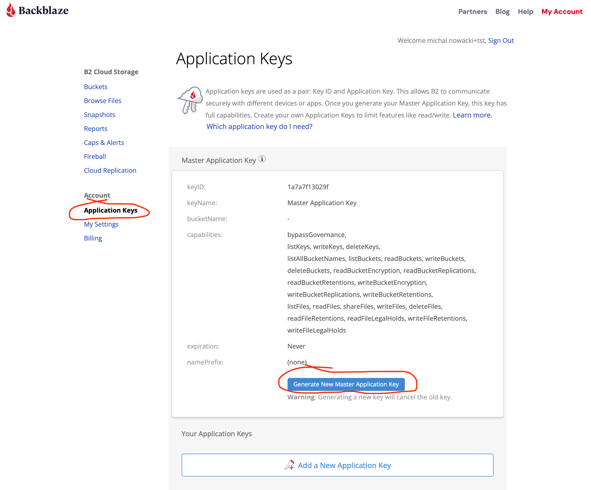

#########################################
Tutorials
#########################################

.. raw:: html

    

***********************
Installation
***********************

To continue with any of the tutorials below, you must install your tool of choice. You can find short
installation instructions below.

.. raw:: html

    

    <button class="tablinks" onclick="unfoldCodeSnippets(event, 'WebUI')" data-language="WebUI">WebUI</button>
    

    <button class="tablinks dropbtn" style="width:250px">Command line</button>
    

        <button class="tablinks" onclick="unfoldCodeSnippets(event, 'B2 CLI')" data-language="B2 CLI">B2 CLI</button>
        <button class="tablinks" onclick="unfoldCodeSnippets(event, 'AWS CLI')" data-language="AWS CLI">AWS CLI</button>

    

    

    

    <button class="tablinks dropbtn">SDK</button>
    

        <button class="tablinks" onclick="unfoldCodeSnippets(event, 'b2sdk')" data-language="b2sdk">b2sdk</button>
        <button class="tablinks" onclick="unfoldCodeSnippets(event, 'boto3')" data-language="boto3">boto3</button>

    

    

    

        

No installation required.

.. raw:: html

    

    

.. code-block:: shell

    pip install b2

.. raw:: html

    

    

Follow instructions here: `https://docs.aws.amazon.com/cli/latest/userguide/getting-started-install.html
<https://docs.aws.amazon.com/cli/latest/userguide/getting-started-install.html>`_

.. raw:: html

    

    

.. code-block:: shell

    pip install b2sdk

.. raw:: html

    

    

.. code-block:: shell

    pip install boto3

.. raw:: html

    

Detailed instructions can be found here: :doc:`./installation`.

***********************
Authorization
***********************

After signing in to `B2 Cloud Storage website <https://www.backblaze.com/cloud-storage>`_ generate a new Master
Application Key from the "Application Keys" view.

Take note of the presented `keyId` and `applicationKey`.

.. raw:: html

    

    <button class="tablinks" onclick="unfoldCodeSnippets(event, 'WebUI')" data-language="WebUI">WebUI</button>
    

    <button class="tablinks dropbtn" style="width:250px">Command line</button>
    

        <button class="tablinks" onclick="unfoldCodeSnippets(event, 'B2 CLI')" data-language="B2 CLI">B2 CLI</button>
        <button class="tablinks" onclick="unfoldCodeSnippets(event, 'AWS CLI')" data-language="AWS CLI">AWS CLI</button>

    

    

    

    <button class="tablinks dropbtn">SDK</button>
    

        <button class="tablinks" onclick="unfoldCodeSnippets(event, 'b2sdk')" data-language="b2sdk">b2sdk</button>
        <button class="tablinks" onclick="unfoldCodeSnippets(event, 'boto3')" data-language="boto3">boto3</button>

    

    

    

        

No authorization, past the login screen, required.

.. raw:: html

    

    

.. code-block:: shell

    B2_APPLICATION_KEY_ID=keyId B2_APPLICATION_KEY=applicationKey b2 authorize-account
    # After this operation, your CLI tool is authorized and
    # all following commands will operate in the
    # context of this account.

.. raw:: html

    

    

.. code-block:: shell

    aws configure --profile b2tutorial
    # fill in the prompting inputs as follows:
    # AWS Access Key ID [None]: keyId
    # AWS Secret Access Key [None]: applicationKey
    # Default region name [None]:
    # Default output format [None]: json
    aws configure --profile b2tutorial set default.s3.signature_version s3v4

In order to interact with B2 using :code:`aws` CLI you will need to provide the :code:`--profile` and
:code:`--endpoint-url` parameters with each invocation, e.g.

.. code-block:: shell

    aws –-profile b2tutorial --endpoint-url https://s3.us-west-004.backblazeb2.com s3api list-buckets

To get your :code:`--endopint-url` value you must TODO!!!

Note that your master key won't work with :code:`aws`, see `key creation`_ for information on how to get a non-master
key.

.. raw:: html

    

    

.. code-block:: python

    from b2sdk.v2 import B2Api
    b2_api = B2Api(info)
    b2_api.authorize_account("production", keyId, applicationKey)
    # from now on, any operation you make on `b2api` will be executed in the context of your account

.. raw:: html

    

    

.. code-block:: python

    import boto3
    from botocore.client import Config
    b2 = boto3.resource(
        service_name='s3',
        endpoint_url='https://s3.us-west-004.backblazeb2.com',
        aws_access_key_id=keyId,
        aws_secret_access_key=applicationKey,
        config=Config(signature_version='s3v4'),
    )

Note that your master key won't work with :code:`boto3`, see `key creation`_ for information on how to get a non-master
key.

To get your :code:`endopint-url` value you must TODO!!!

.. raw:: html

    

***********************
key creation
***********************

.. raw:: html

    

    <button class="tablinks" onclick="unfoldCodeSnippets(event, 'WebUI')" data-language="WebUI">WebUI</button>
    

    <button class="tablinks dropbtn" style="width:250px">Command line</button>
    

        <button class="tablinks" onclick="unfoldCodeSnippets(event, 'B2 CLI')" data-language="B2 CLI">B2 CLI</button>
        <button class="tablinks" onclick="unfoldCodeSnippets(event, 'AWS CLI')" data-language="AWS CLI">AWS CLI</button>

    

    

    

    <button class="tablinks dropbtn">SDK</button>
    

        <button class="tablinks" onclick="unfoldCodeSnippets(event, 'b2sdk')" data-language="b2sdk">b2sdk</button>
        <button class="tablinks" onclick="unfoldCodeSnippets(event, 'boto3')" data-language="boto3">boto3</button>

    

    

    

        

Go to keys view

.. image:: ./key_creation_1.png

Hit "Add a New Application Key" and fill out the details (just the name, for the sake of this tutorial).

.. image:: ./key_creation_2.png

.. raw:: html

    

    

.. code-block:: shell

    b2 create-key --allCapabilities toad-enthusiast
    # you will see keyId and applicationKey

.. raw:: html

    

    

Not supported.

.. raw:: html

    

    

.. code-block:: python

    from b2sdk.v2 import ALL_CAPABILITIES
    key = b2_api.create_key(ALL_CAPABILITIES, 'toad-enthusiast')
    print(key.id_, key.application_key)

.. raw:: html

    

    

Not supported.

.. raw:: html

    

**********************************************
Buckets
**********************************************

Before you start uploading and downloading objects (files) you must create a bucket.

.. raw:: html

    

    <button class="tablinks" onclick="unfoldCodeSnippets(event, 'WebUI')" data-language="WebUI">WebUI</button>
    

    <button class="tablinks dropbtn" style="width:250px">Command line</button>
    

        <button class="tablinks" onclick="unfoldCodeSnippets(event, 'B2 CLI')" data-language="B2 CLI">B2 CLI</button>
        <button class="tablinks" onclick="unfoldCodeSnippets(event, 'AWS CLI')" data-language="AWS CLI">AWS CLI</button>

    

    

    

    <button class="tablinks dropbtn">SDK</button>
    

        <button class="tablinks" onclick="unfoldCodeSnippets(event, 'b2sdk')" data-language="b2sdk">b2sdk</button>
        <button class="tablinks" onclick="unfoldCodeSnippets(event, 'boto3')" data-language="boto3">boto3</button>

    

    

    

        

Go to buckets view.

.. image:: ./creating_buckets_1.png

Hit "create bucket" and fill out the details.

.. image:: ./creating_buckets_2.png

.. raw:: html

    

    

.. code-block:: shell

    b2 create-bucket pictures-of-toads allPrivate

.. raw:: html

    

    

.. code-block:: shell

    aws --profile b2tutorial --endpoint-url https://s3.us-west-004.backblazeb2.com s3api create-bucket --bucket pictures-of-toads

.. raw:: html

    

    

.. code-block:: python

    bucket = b2api.create_bucket('pictures-of-toads', 'allPrivate')

.. raw:: html

    

    

.. code-block:: python

    b2.create_bucket(Bucket='pictures-of-toads', ACL='private')

.. raw:: html

    

NOTE: bucket name has to be globally unique, otherwise you will get an error. For the sake of this tutorial we only
focus on private buckets.

***********************
simple upload
***********************

Now, on any machine that ran :code:`b2 authorize-account` with the same key you can upload a file to
:code:`pictures-of-toads`:

.. raw:: html

    

    <button class="tablinks" onclick="unfoldCodeSnippets(event, 'WebUI')" data-language="WebUI">WebUI</button>
    

    <button class="tablinks dropbtn" style="width:250px">Command line</button>
    

        <button class="tablinks" onclick="unfoldCodeSnippets(event, 'B2 CLI')" data-language="B2 CLI">B2 CLI</button>
        <button class="tablinks" onclick="unfoldCodeSnippets(event, 'AWS CLI')" data-language="AWS CLI">AWS CLI</button>

    

    

    

    <button class="tablinks dropbtn">SDK</button>
    

        <button class="tablinks" onclick="unfoldCodeSnippets(event, 'b2sdk')" data-language="b2sdk">b2sdk</button>
        <button class="tablinks" onclick="unfoldCodeSnippets(event, 'boto3')" data-language="boto3">boto3</button>

    

    

    

        

Go to file browsing view.

.. image:: ./upload_file_1.png

Choose destination bucket.

.. image:: ./upload_file_2.png

Upload your file.

.. image:: ./upload_file_3.png

.. raw:: html

    

    

.. code-block:: shell

    b2 upload-file pictures-of-toads /home/todd/pictures/fire-bellied-toad.png fire-bellied-toad.png

.. raw:: html

    

    

.. code-block:: shell

    aws --profile b2tutorial --endpoint-url https://s3.us-west-004.backblazeb2.com s3api put-object \
      --bucket pictures-of-toads --key fire-bellied-toad.png --body /home/todd/pictures/fire-bellied-toad.png

.. raw:: html

    

    

.. code-block:: python

    bucket = b2api.get_bucket_by_name('pictures-of-toads')
    bucket.upload_local_file('/home/todd/pictures/fire-bellied-toad.png', 'fire-bellied-toad.png')

.. raw:: html

    

    

.. code-block:: python

    with open('/home/todd/pictures/fire-bellied-toad.png', 'br') as file:
        b2.Object(  # TODO: this doesn't work, need to figure out why
            'fire-bellied-toad.png',
            'pictures-of-toads',
        ).put(Body=file)

.. raw:: html

    

this will create an object that users of your account can download.

**********************************************
THIS MARKS THE END OF POLYGLOT DOCUMENTATION
**********************************************

***********************
upload to a directory
***********************

B2 objects aren't **exactly** stored in directories, but for all practical purposes you can use slashes in file paths as
if they were

.. code-block:: shell

    b2 upload-file pictures-of-toads /home/todd/pictures/fire-bellied-toad.png indo-european-toads/fire-bellied-toad.png

***********************
simple download
***********************

Downloading is as simple as

.. code-block:: shell

    b2 download-file-by-name pictures-of-toads fire-bellied-toad.png /home/fred/pictures/fire-bellied-toad.png

***********************
listing files
***********************

For seeing what files are already uploaded to a bucket, use the :code:`ls` command:

.. code-block:: shell

    b2 ls pictures-of-toads

you will see:

.. code-block:: shell

    fire-bellied-toad.png
    indo-european-toads/

if you need to know the contents of a directory, you can specify it

.. code-block:: shell

    b2 ls pictures-of-toads indo-european-toads

.. code-block:: shell

    indo-european-toads/fire-bellied-toad.png

Or even browse everything in one go:

.. code-block:: shell

    b2 ls pictures-of-toads --recursive

.. code-block:: shell

    fire-bellied-toad.png
    indo-european-toads/fire-bellied-toad.png

***********************
reupload
***********************

If you happen to upload a file again (with the same name in the same bucket):

.. code-block:: shell

    b2 upload-file pictures-of-toads /home/todd/pictures/fire-bellied-toad-v2.png fire-bellied-toad.png

you will only see the new one when listing files:

.. code-block:: shell

    b2 ls pictures-of-toads

you will see:

.. code-block:: shell

    fire-bellied-toad.png
    indo-european-toads/

also the new file will be downloaded if you try it:

.. code-block:: shell

    b2 download-file-by-name pictures-of-toads fire-bellied-toad.png /home/fred/pictures/fire-bellied-toad.png

but the "old version" is not gone (unlike on local drive). B2 Cloud Storage holds versions of files. If you "reupload"
a file, the new version "covers" the old one, but the old one can still be accessed:

.. code-block:: shell

    b2 ls pictures-of-toads --versions --long

.. code-block:: shell

   4_z7786dd31f6631c2a7cc8071c_f410587b5929a76ac_d20230921_m195738_c000_v0001061_t0047_u01695326258129  upload  2023-09-21  19:57:38          5  fire-bellied-toad.png
   4_z7786dd31f6631c2a7cc8071c_f402fafdefdfb97f9_d20230921_m191948_c000_v0001049_t0047_u01695323988977  upload  2023-09-21  19:19:48          5  fire-bellied-toad.png
                                                                                  -       -           -         -          0  indo-european-toads/

.. code-block:: shell

    b2 ls download-file-by-id 4_z7786dd31f6631c2a7cc8071c_f402fafdefdfb97f9_d20230921_m191948_c000_v0001049_t0047_u01695323988977 /home/fred/pictures/fire-bellied-toad.png

(Notice how `bucket_name` is not specified for this download operation, that's because and `id` uniquely identifies
a file in B2 Cloud Storage).

Because the "old" file is still accessible, it still incurs storage costs.

***********************
directory upload
***********************

There is a separate command for uploading directories

.. code-block:: shell

    b2 sync /home/fred/pictures/ b2://pictures-of-toads/some-directory/

***********************
directory download
***********************

As well as for downloading

.. code-block:: shell

    b2 sync b2://pictures-of-toads/some-directory/ /home/fred/pictures/

***********************
hiding files
***********************

Hiding files allows for making them invisible to `ls` and `sync` commands, while leaving the ability to download them
by id.

.. code-block:: shell

    b2 hide-file pictures-of-toads fire-bellied-toad.png

***********************
deleting files
***********************
It is possible to irreversibly delete a file, though that requires fetching it's `id` first:

.. code-block:: shell

    b2 delete-file-version fire-bellied-toad.png 4_z7786dd31f6631c2a7cc8071c_f402fafdefdfb97f9_d20230921_m191948_c000_v0001049_t0047_u01695323988977

*********************************************************************
deleting buckets
*********************************************************************

