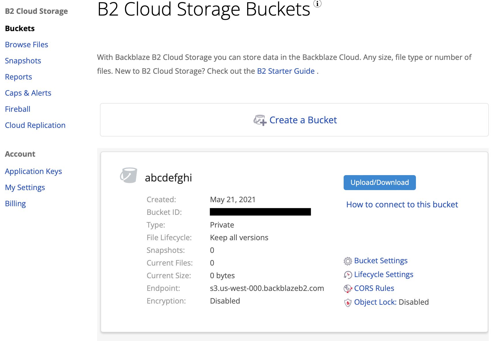

#########################################
Establishing S3 endpoint URL
#########################################

After creating a bucket, log in to the WebUI, navigate to "Buckets":

The value marked as "Endpoint" is the base for your S3 :code:`endpoint-url` for ALL operations using this account.
In this case, the :code:`endpoint-url` will be :code:`https://s3.us-west-000.backblazeb2.com`

